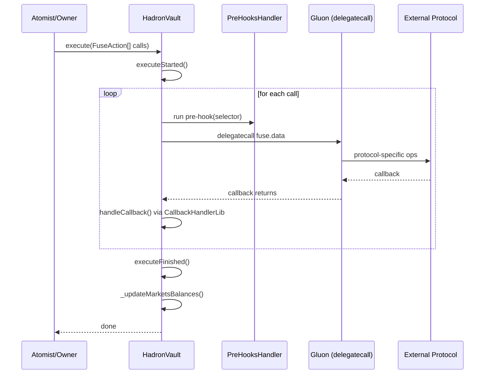
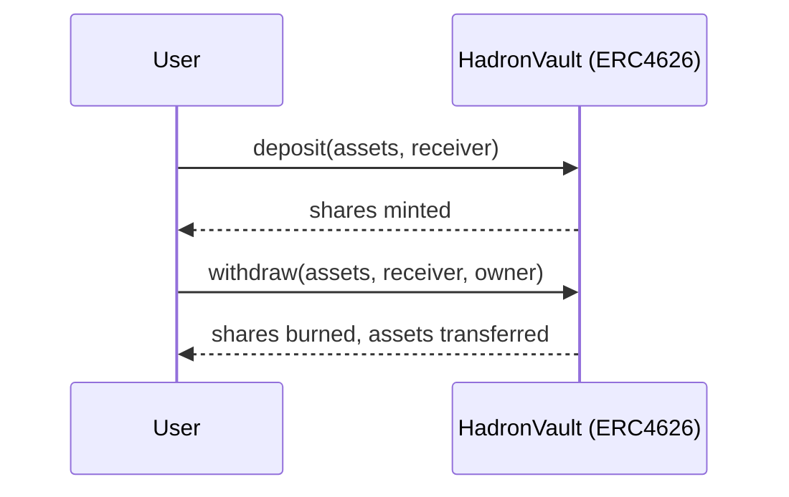

# Hadron Vault Infrastructure (Unus Nullus UAB)

This repository contains Hadron — the Unus Nullus UAB vault infrastructure: an appropriate, modular ERC4626-based system for
general-purpose vaults. It enables automated on-chain asset management via pluggable integrations ("fuses") while
keeping the core minimal and protocol-agnostic.

## Technical Overview

For architecture details and usage guides, refer to the docs in this repository.

### Architecture Schema

The Hadron Vault is a minimal ERC4626 vault with modular protocol adapters called "gluons" executed via delegatecall. Core pieces are upgrade-friendly and use ERC-7201 namespaced storage.

```mermaid
flowchart LR
  subgraph User/Offchain
    U[User / Frontend]
  end

  subgraph Hadron_Vault_Core
    HV[HadronVault (ERC4626)]
    HVB[(HadronVaultBase via delegatecall)]
    PH[PreHooksHandler]
    UR[UniversalReader]
  end

  subgraph Libraries_Storage
    HLS[(HadronVaultStorageLib - ERC-7201)]
    HLib[HadronVaultLib]
    FLib[FusesLib]
    FSL[(FuseStorageLib - supported fuses)]
    CHL[CallbackHandlerLib]
  end

  subgraph Gluons (protocol adapters)
    G1[Balance Gluons]
    G2[Market Action Gluons]
    G3[Rewards Gluons]
  end

  subgraph Access_Control
    AM[AccessManagedUpgradeable / Access Manager]
  end

  subgraph External_Protocols
    P1[(Aave / Compound / Uniswap / ...)]
  end

  U -->|deposit/mint| HV
  U -->|withdraw/redeem| HV
  U -->|execute(FuseAction[])| HV

  HV -->|delegatecall| HVB
  HV -->|pre-hooks| PH
  HV -->|delegatecall| G1
  HV -->|delegatecall| G2
  HV -->|delegatecall| G3

  G1 --> P1
  G2 --> P1
  G3 --> P1

  %% callbacks during execute
  P1 --> CHL --> HV

  HV --> HLS
  HV --- HLib
  HV --- FLib
  FLib --- FSL
  HV --- UR
  HV --> AM
```

Key points:
- HadronVault exposes standard ERC4626 (deposit, mint, withdraw, redeem) with role-gated access on sensitive functions.
- Gluons are protocol-specific adapters executed via `delegatecall` from the vault.
- Pre-hooks can enforce additional checks before selected function calls.
- Callback handler safely routes protocol callbacks only during active execution.
- Storage is centralized in `HadronVaultStorageLib` (ERC-7201). Supported fuses are tracked in `FuseStorageLib`.

### Execution Flow (execute with gluons)



### ERC4626 Flows (simplified)



## Installation

To install the dependencies for this project:

```bash
npm install
```

This will install all the required Node.js packages listed in [package.json](./package.json).

## Smart Contract Development

This project uses Foundry for Ethereum smart contract development. To get started with Foundry:

1. Install Foundry by following [Foundry's installation guide](https://getfoundry.sh/).
2. Build the smart contracts using:

```bash
forge build
```

## Testing

To run smart contract tests, you need to set up a `.env` file with the required environment variables.

### Environment Variables
An example `.env` file is in [.env.example](./.env.example). Copy this file to `.env` and fill in the required values.

- `ETHEREUM_PROVIDER_URL` - Ethereum provider URL
- `ARBITRUM_PROVIDER_URL` - Arbitrum provider URL
- `BASE_PROVIDER_URL` - Base provider URL
- `TAC_PROVIDER_URL` - TAC provider URL
- `INK_PROVIDER_URL` - Ink provider URL

Test smart contracts using:

```bash
forge test -vvv --ffi
```

## Pre-commit hooks

### requirements

- Python 3.11.6
- Node.js 20.17.0

### install pre-commit

use instruction from https://pre-commit.com/

#### install pre-commit

- `pip install pre-commit`
- `pre-commit install`

## Workflows

This repository includes several GitHub Actions workflows located in `.github/workflows/`:

- **CI Workflow** (`ci.yml`): Runs continuous integration tasks.
- **CD Workflow** (`cd.yml`): Manages continuous deployment processes.

## License

For more details, see the [LICENSE](./LICENSE) file.
