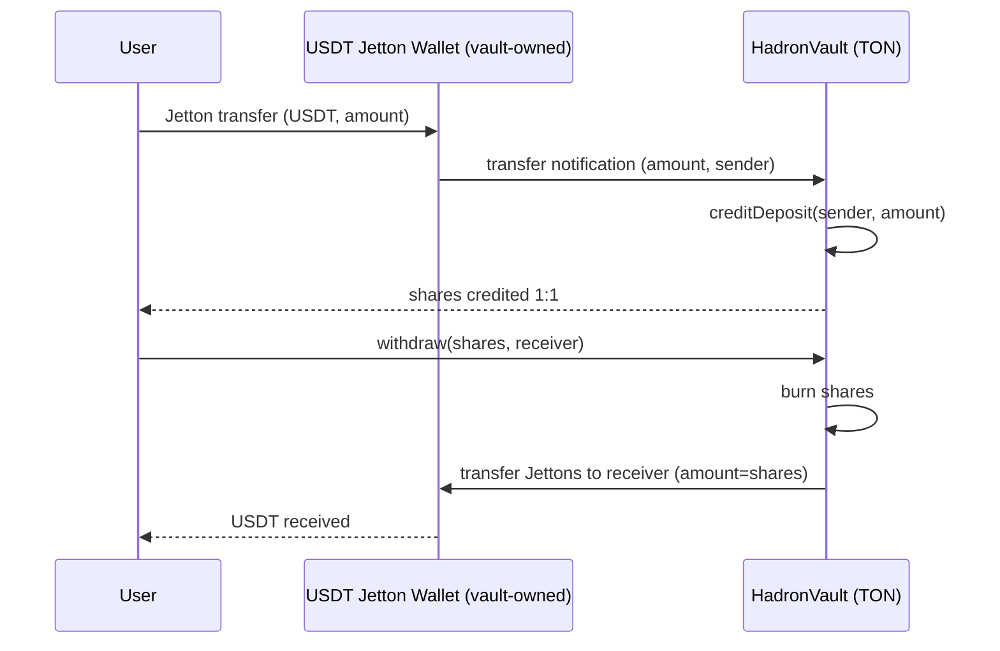

# Hadron Vault on TON (Unus Nullus UAB)

This module mirrors the Hadron (EVM) architecture for the TON blockchain, using Tact for smart contracts.

- Core vault: tokenized strategy vault with pluggable protocol adapters ("gluons")
- Gluons: protocol-specific adapters executed by the vault
- Pre-hooks: optional checks executed before sensitive calls
- Access control: role-based gating for admin and operator actions

## Architecture Schema (TON)

```mermaid
flowchart LR
  subgraph User/Offchain
    U[User / Frontend]
  end

  subgraph Hadron_TON_Core
    HV[HadronVault (TON)]
    PH[PreHooks]
  end

  subgraph Gluons (protocol adapters)
    G1[Balance Gluons]
    G2[Market Action Gluons]
    G3[Rewards Gluons]
  end

  subgraph Access_Control
    AM[Access Control]
  end

  subgraph External_Protocols
    P1[(DEX / Lending / Bridges on TON)]
  end

  U -->|deposit/mint| HV
  U -->|withdraw/redeem| HV
  U -->|execute(actions)| HV

  HV --> PH
  HV --> G1
  HV --> G2
  HV --> G3

  G1 --> P1
  G2 --> P1
  G3 --> P1

  HV --> AM
```

## USDT on TON: Vault Behavior

The TON HadronVault currently supports accepting USDT via Jetton standard.

- `usdt_root`: Address of the USDT Jetton Root.
- `usdt_vault_wallet`: Address of the vault-owned Jetton Wallet holding USDT on behalf of the vault.
- Shares are 1:1 with deposited USDT amounts in the current scaffold.

### Lifecycle

1. Admin deploys `HadronVault` with `owner`, `usdt_root`, and `usdt_vault_wallet`.
2. Users transfer USDT Jettons to the vault’s Jetton wallet.
3. The vault wallet notifies the vault; the vault credits user shares.
4. Users withdraw by burning shares; the vault wallet transfers Jettons to the receiver.

## Contract API (scaffold)

File: `contracts/HadronVault.tact`

- `init(owner: address, usdt_root: address, usdt_vault_wallet: address)`
  - Initializes owner, Jetton root, and the vault's Jetton wallet addresses.

- `setUsdtVaultWallet(addr: address)` (owner-only)
  - Rotates the vault’s USDT Jetton wallet.

- `creditDeposit(from: address, amount: int)`
  - Credits deposit for `from` with `amount` USDT. Must be called by `usdt_vault_wallet` upon Jetton transfer notification.

- `withdraw(shares: int, receiver: address)`
  - Burns caller's `shares` and instructs the vault wallet to transfer USDT Jettons to `receiver`.

> Note: The current implementation includes a placeholder internal message for Jetton transfers; integrate the official Jetton wallet transfer ABI for production.

## USDT Flows (TON)



## Repo Layout

```
ton/
  contracts/
    HadronVault.tact
    gluons/
      IGluon.tact
      ExampleBalanceGluon.tact
    access/
      AccessControl.tact
    prehooks/
      PreHooks.tact
  README.md
  package.json
  tact.config.json
```

## Build & Test

- Install Tact toolchain: `npm i -g tact-cli`
- Install deps in this module: `npm i`
- Build: `npm run build`
- Test (placeholder): `npm run test`

## Notes

- Storage and execution semantics differ from EVM; the design mirrors concepts, not bytecode.
- Gluon interfaces and pre-hook registry follow the same patterns for modularity.
- Replace placeholder Jetton message bodies with the official Jetton wallet transfer/notify payloads.
